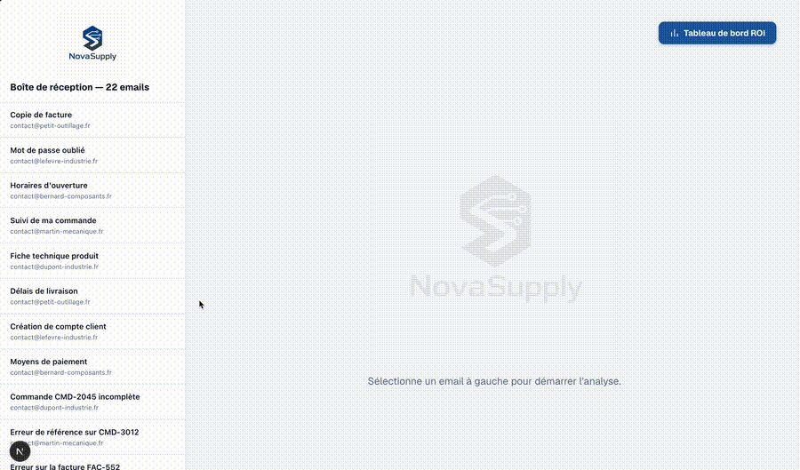

# NovaSupply Inbox AI

Production-ready AI workflow for email support, document extraction, context verification and human approval.



## The problem

*NovaSupply* is a fictional B2B distributor of industrial automation components — pressure sensors, valves, cables, electronic control modules — sold to manufacturing SMEs (a garage, a workshop, a factory ordering parts for their equipment). It receives a steady stream of customer emails: password resets, delivery questions, incomplete orders ("I ordered 10 pressure sensors and 3 control modules, only the sensors arrived"), billing disputes, legal threats. Every single one currently gets the same treatment — a human reads it, decides what it means, checks the order system, and writes a reply. Simple requests take just as long as complex ones to triage, because nothing pre-sorts them.

This project automates that triage and drafting step — without removing the human from decisions that matter.

## The workflow

```
Email received
    ↓
Classify (category, priority, complexity, sentiment, confidence)
    ↓
[if a document is attached] Extract structured data from it
    ↓
[if the case references real data] Verify it against actual orders/clients
    ↓
Generate a reply draft + suggested internal actions
    ↓
Human reviews: Approve / Modify / Reject / Transfer
```

The system never invents facts about a customer's order — it looks them up. And it never auto-sends a reply to a complex or upset customer — it routes those to a human instead.

## Three levels of handling

| Level | Example | Action |
|---|---|---|
| 1 — Simple | "How do I reset my password?" | Automatic reply, no human needed |
| 2 — Needs verification | "My order is missing 2 units" | Draft generated, human approves before sending |
| 3 — Needs a human | "I'm contacting my lawyer" | Routed directly to a human, no draft attempted |

The model isn't trusted to make this call alone — `automatic_reply` is only allowed when complexity is level 1 *and* the customer isn't angry. Everything else gets either a draft or a handoff.

## Architecture

- **Frontend + backend**: Next.js 16 (App Router, TypeScript) — a single app serving both the API routes and the validation UI.
- **AI model**: Claude Haiku 4.5 via the Anthropic API, with structured outputs (JSON schema) so every response is guaranteed parseable — no regex-scraping a chat response.
- **Data**: *NovaSupply* (see "The problem" above for what it actually sells). Two sources, each kept in its natural role rather than forced into one: **HubSpot** (a real CRM, free-tier account) is the source of truth for the client and what they ordered (Contact + Deal + line items); `apps/web/demo-data/orders.json` plays the role of the warehouse/ERP system NovaSupply doesn't have, holding only what was actually shipped. A real CRM doesn't know what left the warehouse — that's a logistics system's job, so the demo doesn't pretend otherwise.
- **Endpoints**:
  - `POST /api/classify-ticket` — categorize an email and decide its handling level
  - `POST /api/extract-document` — read a PDF attachment (e.g. a purchase order) into structured JSON
  - `POST /api/retrieve-context` — look up the client + their order in HubSpot (Contact → Deal → line items), cross-reference with the fulfillment data, and compute actual discrepancies (ordered vs. shipped)
  - `POST /api/generate-reply` — draft a reply grounded in the classification + verified context
- **Validation UI** (`/`): an inbox of demo emails; selecting one runs the pipeline live and shows every step — the PDF extraction (if an attachment is present), the classification, the verified context (if any), the draft, and the four decision buttons.
- **ROI dashboard** (`/dashboard`): real metrics only — built from actual clicks in the UI, not simulated numbers. Tracks volume by handling level, real API cost (computed from actual token usage), and the rate of drafts approved without edits.

## Automation rules

The model doesn't get unrestricted authority to decide everything — routing follows explicit rules layered on top of its classification:

```ts
if (complexity_level === 1 && sentiment !== "angry") {
  return "automatic_reply";
}
if (complexity_level === 3) {
  return "human_review";
}
return "draft_for_approval";
```

This is the same principle the project is built around: let the model classify and draft, but keep deterministic rules in charge of what happens next.

## Evaluation results

`apps/web/evaluations/tickets.json` holds 22 hand-written test cases (8 level-1, 8 level-2, 6 level-3) spanning password resets, incomplete orders, billing errors, legal threats, and ambiguous complaints. Running `npm run eval` against the live classification endpoint typically scores **95-100%** on both classification level and routing action, across repeated runs.

The recurring miss, when it happens, is the deliberately ambiguous case: *"I don't know exactly what the problem is, but something's wrong with my last order."* It's designed to be hard — there's no extractable detail — and the model occasionally classifies it as level 2 (draft for approval) instead of level 3 (human review). LLM classification isn't perfectly deterministic, so re-running `npm run eval` may show small variation between runs. This is the actual behavior, not a cherry-picked best run.

## Limitations

Being upfront about what this is *not*:

- **No real inbox integration.** The "inbox" is a static JSON list, not a live Gmail/IMAP connection.
- **"Suggested actions" aren't executed.** They're generated text (create ticket, assign to logistics...), not actually written back to HubSpot — the CRM connection is currently read-only.
- **Only one demo client is wired into HubSpot.** Dupont Industrie / CMD-2045 is set up end-to-end as a real Contact + Deal + line items; the other 4 demo clients still only exist in the (now unused for lookups) `clients.json`, so `/api/retrieve-context` returns a clean 404 for them rather than a fabricated answer.
- **Small, hand-built dataset.** 22 test cases are enough to prove the approach, not a production-scale benchmark.
- **Classification isn't perfectly deterministic.** The same ambiguous email can occasionally be routed to a different level on re-evaluation (see Evaluation results above) — a known characteristic of LLM-based classification, not a bug to silently ignore.
- **No authentication or multi-tenant support.** This is a single-operator demo, not a deployable SaaS.

## n8n orchestration (real Gmail integration)

Beyond the validation UI (which uses a static demo inbox), `n8n/email-workflow.json` is a real n8n workflow that connects to an actual Gmail account and runs the full pipeline automatically on incoming mail:

```
Gmail Trigger (new unread email)
    → Get full message content
    → POST /api/classify-ticket
    → Switch (route by complexity_level)
        ├─ Level 1 → POST /api/generate-reply → Gmail reply sent automatically to the customer
        ├─ Level 2 → POST /api/retrieve-context → POST /api/generate-reply → Gmail notification to a human with the draft for approval (never auto-sent to the customer)
        └─ Level 3 → POST /api/generate-reply (no context lookup) → Gmail notification to a human for direct handoff
```

n8n calls the same four endpoints the validation UI uses — it doesn't reimplement any classification or business logic, it's purely an orchestrator. Verified end-to-end with a real Gmail inbox across all three levels: a password-reset email triggered an automatic reply sent directly to the customer (level 1); a genuine "order CMD-4006 is missing items" email — sent from an external mailbox with a real PDF purchase order attached (`apps/web/public/demo-attachments/CMD-4006.pdf`) — was classified as level 2, had its attachment parsed by `/api/extract-document`, matched against the real order discrepancy in `demo-data/`, and produced a reply draft delivered as a human-approval notification rather than sent to the customer; and a message threatening legal action was classified as level 3 and forwarded to a human with no draft sent to the customer.

To run it:

```bash
docker compose up -d        # starts n8n on http://localhost:5678
```

Import `n8n/email-workflow.json`, connect your own Gmail OAuth credentials (Google Cloud Console → OAuth client, redirect URI `http://localhost:5678/rest/oauth2-credential/callback`), and point the HTTP Request nodes at `http://host.docker.internal:3000` (n8n runs in Docker; this resolves to your host machine where the Next.js app runs).

## Cost per operation

Every classification and draft generation call returns the real cost, computed from actual token usage (not estimated): Claude Haiku 4.5 pricing is $1 / million input tokens and $5 / million output tokens. A typical classification call costs well under $0.001. The ROI dashboard aggregates this in real time as tickets are processed — there's no need to take a marketing number on faith; run it yourself and watch the dashboard update.

## ROI math

A full level-1 ticket (classification + reply generation) costs **~$0.0022** end to end — measured, not estimated, from the actual `cost_usd` returned by both calls. Compare that to a rough industry baseline for a human agent handling a simple ticket (read, look up, reply): a few minutes of loaded support time, typically in the €1-2 range per ticket. That's a **>99% reduction in marginal cost** on the tickets the system is allowed to fully automate (level 1, ~36% of the 22-case eval set).

To be precise about what this number is and isn't: it's the AI cost of automating a single simple ticket type, not a measured production saving from a real company running real volume — NovaSupply is fictional and has no real ticket history. Treat it as a per-operation cost comparison, not a guaranteed ROI claim.

The same logic extends to the other two levels: level 2 doesn't remove the human, it removes the *lookup and first-draft* work (the part Anthropic's usage data shows costs the same fraction of a cent), leaving a human to review rather than write from scratch. Level 3 is intentionally not automated at all — the cost there is zero by design, because the system routes it to a human instead of guessing.

## Running it locally

```bash
cd apps/web
npm install
echo "ANTHROPIC_API_KEY=sk-ant-..." > .env.local
echo "HUBSPOT_PRIVATE_APP_TOKEN=pat-..." >> .env.local
npm run dev
```

`HUBSPOT_PRIVATE_APP_TOKEN` comes from a free HubSpot account → Settings → Integrations → a "service key" / private app with `crm.objects.contacts.read`, `crm.objects.deals.read`, `crm.objects.deals.write` and `crm.objects.line_items.read` scopes.

Open `http://localhost:3000`, click an email, watch the pipeline run.

To run the evaluation suite (server must be running):

```bash
npm run eval
```

## Demo video

_Coming soon._

## Tech stack

Next.js 16 · TypeScript · Anthropic API (Claude Haiku 4.5, structured outputs) · React
